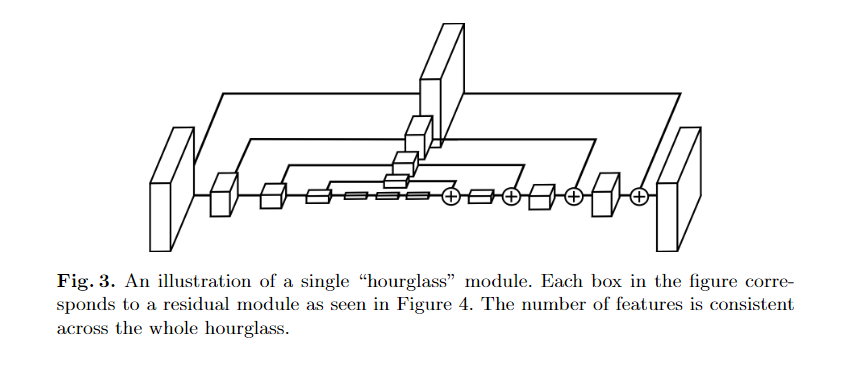
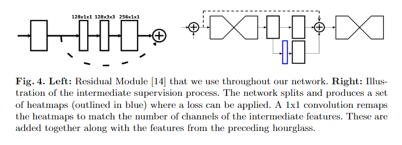

# stacked-hourglass.paddle         

## 一、简介

百度AiStudio论文复现挑战赛，复现论文：[Stacked Hourglass Networks for Human Pose Estimation](https://arxiv.org/abs/1603.06937)

hourglass使用了重复的下采样和上采样过程来重复的学习图像中的关键点特征，每个堆叠的hourglass模块后还会加上中间监督，以更好的生成关键点的热图。hourglass算法在2016年时取得了FLIC和MPII两个数据集的SOTA性能。

论文的实现主要分为三个部分：

1、hourglass模块



hourglass模块呈现相同的top-down和bottom-up的过程，同时学习了最新的ResNet的技术，在每个特征图相同大小的层之间都采用残差模块连接。

2、残差模块和中间监督



hourglass模块中的每个方块都是类似上图左边的这种残差连接方式。

在每个hourglass模块结束时，由于输出的通道数是256，所以作者需要对输出通道数重新进行调整才能得到可以用于中间监督的通道数。
为了继续训练，在下一个hourglass模块前，也必须把输出通道数重新映射到256。

3、整体结构

模型的输入大小是(N, 3, 256, 256)，为了降低模型的显存占用和计算复杂度，在进入hourglass模块前，网络先使用MaxPool对输入图像调整到64x64。


## 二、复现精度

复现要求如下表所示。

|  网络结构    |  图片大小 |  精度         |
|--------------|-----------|---------------|
|   hourglass  | 256x256   | mean@.1 0.317 |
| ~            | 384x384   | mean@.1 0.366 |

复现结果如下表所示。

|  网络结构    |  图片大小 |  精度         | 硬件         |
|--------------|-----------|---------------|---------------|
|   hourglass  | 256x256   | mean@.1 0.317 | RTX 2080 Ti    |
| ~            | 384x384   | mean@.1 0.366 | RTX 2080 Ti   |

## 三、数据集

[MPII Human Pose Dataset](http://human-pose.mpi-inf.mpg.de/#download)

由于MPII原始的标注格式使用的是matlab的格式，不便于python使用，所以我使用了来自[HRNet](https://github.com/leoxiaobin/deep-high-resolution-net.pytorch)作者转换后的MPII的json标注格式。

## 四、环境依赖

见[requirements.txt](requirements.txt)，推荐使用百度源（https://mirror.baidu.com/pypi/simple）进行安装。

Ubuntu：18.04

CUDA: 11.2.2

CUDNN: 8.1.0.77

## 五、快速开始

### 5.1 mpii

MPII数据集放在根目录下的`dataset`文件夹下。其目录结构如下所示，

```
dataset
├── mpii
│   ├── annot               # label文件夹
│   │   ├── gt_valid.mat
│   │   ├── test.json
│   │   ├── train.json
│   │   ├── trainval.json
│   │   └── valid.json
└── └── images              # 图像文件夹
│   │   ├── 000001163.jpg
│   │   └── 000003072.jpg
```

运行以下指令即可按照默认的配置运行训练代码。

```bash
python train.py
```

## 六、代码结构与详细说明

### 6.1 代码结构

```
.
├── README.md               # readme
├── dataset                 # 数据集文件夹
├── lib                     # library
│   ├── Makefile            # 编译CUDA环境的NMS
│   ├── config.py           # 配置文件
│   ├── core                # 训练、测试、推断等
│   ├── dataset             # 数据集
│   ├── models              # 模型文件夹
│   ├── nms                 # NMS
│   └── utils               # 工具文件夹
├── requirements.txt        # 环境依赖
└── train.py                # 训练文件
```

### 6.2 训练参数说明


|  参数名    |  默认值 |  说明         |
|--------------|-----------|---------------|
|   dataset_name  | mpii   | 可选数据集 |
| dataset_dir     | dataset/mpii   | 数据集路径 |
| output_dir     | output   | 输出文件夹根路径，程序会根据模型、数据集、实验的不同生成不同的输出文件夹 |
|   num_stacked_modules  | 8   | 堆叠的模块数量 |
| continue_train     | False   | 继续训练 |

通过给定的命令行参数，在`cfg.set_args(args)`这里合并所有参数和命令行参数。

### 6.4 开始训练

### 6.5 验证

### 6.6 推断 

## 七、模型信息


## 附录

### 参数表

<table class="table table-striped table-bordered">

<thead>

<tr>

<th style="text-align:center">参数名</th>

<th style="text-align:center">含义</th>

</tr>

</thead>

<tbody>

<tr>

<td style="text-align:center">dataset_name</td>

<td style="text-align:center">数据集名称（由数据集名称加载不同的数据集）</td>

</tr>

<tr>

<td style="text-align:center">dataset_dir</td>

<td style="text-align:center">数据集路径</td>

</tr>

<tr>

<td style="text-align:center">num_joints</td>

<td style="text-align:center">关键点数量</td>

</tr>

<tr>

<td style="text-align:center">data_format</td>

<td style="text-align:center">图片格式</td>

</tr>

<tr>

<td style="text-align:center">input_img_shape</td>

<td style="text-align:center">输入图像的size</td>

</tr>

<tr>

<td style="text-align:center">output_hm_shape</td>

<td style="text-align:center">输出heatmap的size</td>

</tr>

<tr>

<td style="text-align:center">sigma</td>

<td style="text-align:center">生成heatmap的高斯分布的$\sigma$参数</td>

</tr>

<tr>

<td style="text-align:center">scale_factor</td>

<td style="text-align:center">缩放尺度</td>

</tr>

<tr>

<td style="text-align:center">flip_factor</td>

<td style="text-align:center">翻转尺度</td>

</tr>

<tr>

<td style="text-align:center">rotation_factor</td>

<td style="text-align:center">旋转尺度</td>

</tr>

<tr>

<td style="text-align:center">prob_half_body</td>

<td style="text-align:center">半身的概率</td>

</tr>

<tr>

<td style="text-align:center">color_rgb</td>

<td style="text-align:center">是否为RGB图像</td>

</tr>

<tr>

<td style="text-align:center">target_type</td>

<td style="text-align:center">目标heatmap的生成方式（仅支持`gaussian`）</td>

</tr>

<tr>

<td style="text-align:center">use_different_joints_weight</td>

<td style="text-align:center">是否对不同的关键点使用不同的权重</td>

</tr>

<tr>

<td style="text-align:center">select_train_data</td>

<td style="text-align:center">选择训练数据</td>

</tr>

<tr>

<td style="text-align:center">test_set</td>

<td style="text-align:center">测试集名称</td>

</tr>

<tr>

<td style="text-align:center">model_name</td>

<td style="text-align:center">模型名称</td>

</tr>

<tr>

<td style="text-align:center">num_stacked_modules</td>

<td style="text-align:center">堆叠的hourglass模块数量</td>

</tr>

<tr>

<td style="text-align:center">num_channels</td>

<td style="text-align:center">hourglass模块内的feature的通道数</td>

</tr>

<tr>

<td style="text-align:center">train_batch_size</td>

<td style="text-align:center">训练的batch大小</td>

</tr>

<tr>

<td style="text-align:center">train_workers</td>

<td style="text-align:center">训练时的加载线程数</td>

</tr>

<tr>

<td style="text-align:center">start_epoch</td>

<td style="text-align:center">开始的epoch</td>

</tr>

<tr>

<td style="text-align:center">end_epoch</td>

<td style="text-align:center">结束的epoch</td>

</tr>

<tr>

<td style="text-align:center">train_print_freq</td>

<td style="text-align:center">训练时的打印频率</td>

</tr>

<tr>

<td style="text-align:center">lr</td>

<td style="text-align:center">学习率</td>

</tr>

<tr>

<td style="text-align:center">optimizer</td>

<td style="text-align:center">优化器名称</td>

</tr>

<tr>

<td style="text-align:center">decay_epoch</td>

<td style="text-align:center">学习率的衰减epoch id</td>

</tr>

<tr>

<td style="text-align:center">decay_gamma</td>

<td style="text-align:center">学习率的衰减系数</td>

</tr>

<tr>

<td style="text-align:center">momentum</td>

<td style="text-align:center">RMSprop的动量</td>

</tr>

<tr>

<td style="text-align:center">weight_decay</td>

<td style="text-align:center">RMSprop的权重衰减系数</td>

</tr>

<tr>

<td style="text-align:center">alpha</td>

<td style="text-align:center">RMSprop的$\alpha$系数，在paddle中的实现是$\rho$</td>

</tr>

<tr>

<td style="text-align:center">epsilon</td>

<td style="text-align:center">RMSprop的$\epsilon$参数</td>

</tr>

<tr>

<td style="text-align:center">valid_batch_size</td>

<td style="text-align:center">验证的batch大小</td>

</tr>

<tr>

<td style="text-align:center">valid_workers</td>

<td style="text-align:center">验证的加载线程数</td>

</tr>

<tr>

<td style="text-align:center">valid_print_freq</td>

<td style="text-align:center">验证的打印频率</td>

</tr>

<tr>

<td style="text-align:center">cur_dir</td>

<td style="text-align:center">配置文件目录</td>

</tr>

<tr>

<td style="text-align:center">root_dir</td>

<td style="text-align:center">工程根目录</td>

</tr>

<tr>

<td style="text-align:center">data_dir</td>

<td style="text-align:center">数据目录</td>

</tr>

<tr>

<td style="text-align:center">output_dir</td>

<td style="text-align:center">输出目录</td>

</tr>

<tr>

<td style="text-align:center">model_dir</td>

<td style="text-align:center">输出模型目录</td>

</tr>

<tr>

<td style="text-align:center">vis_dir</td>

<td style="text-align:center">输出图片可视化目录</td>

</tr>

<tr>

<td style="text-align:center">log_dir</td>

<td style="text-align:center">日志目录</td>

</tr>

<tr>

<td style="text-align:center">result_dir</td>

<td style="text-align:center">结果目录</td>

</tr>

<tr>

<td style="text-align:center">log_filename</td>

<td style="text-align:center">日志文件名</td>

</tr>

<tr>

<td style="text-align:center">cfg_filename</td>

<td style="text-align:center">配置文件名</td>

</tr>

<tr>

<td style="text-align:center">save_batch_images_gt</td>

<td style="text-align:center">是否绘制批图片关键点位置</td>

</tr>

<tr>

<td style="text-align:center">save_batch_images_pred</td>

<td style="text-align:center">是否绘制批图片预测值</td>

</tr>

<tr>

<td style="text-align:center">save_heatmaps_gt</td>

<td style="text-align:center">是否绘制批图片ground truth的heatmap</td>

</tr>

<tr>

<td style="text-align:center">save_heatmaps_pred</td>

<td style="text-align:center">是否绘制批图片预测值的heatmap</td>

</tr>

<tr>

<td style="text-align:center">gpu_ids</td>

<td style="text-align:center">GPU id</td>

</tr>

<tr>

<td style="text-align:center">num_gpus</td>

<td style="text-align:center">GPU数量</td>

</tr>

<tr>

<td style="text-align:center">continue_train</td>

<td style="text-align:center">继续训练</td>

</tr>

<tr>

<td style="text-align:center">best_model_path</td>

<td style="text-align:center">最优模型文件路径</td>

</tr>

<tr>

<td style="text-align:center">checkpoint_path</td>

<td style="text-align:center">检查点路径</td>

</tr>

</tbody>

</table>